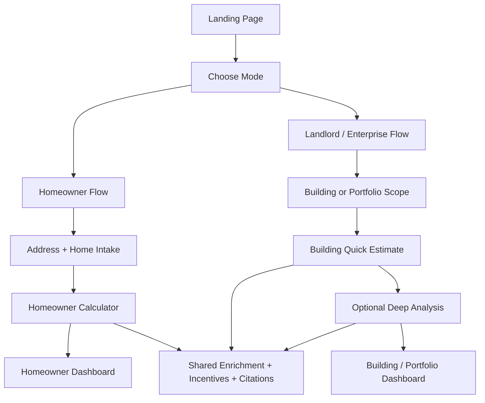

# Landlord / Enterprise Expansion Plan

## Purpose

This document plans a minimal-disruption expansion of RetroFi ATL from an Atlanta homeowner retrofit planner into a two-mode product that also supports small landlords, multifamily owners/operators, property managers, owner-operators, and enterprise portfolio users.

No application code is implemented in this document. It is intended to give a fresh AI session enough context to implement the expansion safely without rediscovering the current architecture.

## Executive Recommendation

Use a shared app shell with a branching wizard and separate mode modules behind it.

Do not implement landlord / enterprise as only a cosmetic mode switch inside the current homeowner flow. The current homeowner path is address-centric, single-property, and single-household. Landlord / enterprise users need different ownership semantics, unit and meter structure, building operations data, portfolio support, and benchmarking-first outputs. A mode switch alone would overload the current questionnaire and risk producing homeowner recommendations for renters or multifamily buildings.

The practical MVP shape should be:

- Keep the existing homeowner flow intact and preserve its current routes and response shape.
- Add an explicit audience / product-mode choice near the start of the flow.
- Use a branching wizard after address or portfolio entry.
- Share low-level services such as RentCast lookup, Google Maps autocomplete, incentive indexing, citations, summary rendering, and design primitives.
- Split intake schemas, plan builders, calculation engines, dashboard panels, and LLM prompts by mode.
- Treat landlord / enterprise as a benchmarking-first flow for MVP, with quick-estimate outputs first and deeper analysis after utility history, documents, or bill uploads are available.



## Current Git / Working Tree Notes

At planning time, the repo already has uncommitted and untracked work. Treat it as user work and do not revert it.

Observed changed files include:

- `backend/main.py`
- `backend/schemas.py`
- `backend/services/incentive_index.py`
- `backend/services/retrofit_analyzer.py`
- `backend/services/retrofit_calculator.py`
- `backend/services/retrofit_request_builder.py`
- `backend/tests/test_generate_plan_integration.py`
- `backend/tests/test_incentive_analysis.py`
- `backend/tests/test_retrofit_calculator.py`
- `frontend/src/Dashboard.jsx`
- `backend/services/building_classifier.py` (untracked)
- `backend/services/building_retrofit_model.py` (untracked)

Earlier status context also showed untracked Chroma files under `backend/data/chroma/`. Do not commit generated vector-store data unless explicitly requested.

## Current-State Summary

### Frontend Routes And User Flow

The frontend is a small React / Vite app under `frontend/src`.

Current routes are defined in `frontend/src/App.jsx`:

- `/` renders `LandingPage`
- `/verify` renders `PropertyVerification`
- `/questionnaire` renders `Questionnaire`
- `/dashboard` renders `Dashboard`

The current homeowner flow is:

1. `frontend/src/LandingPage.jsx`
   - Uses Google Places autocomplete.
   - Prompts for an Atlanta home address.
   - Calls `lookupProperty(address)` from `frontend/src/api.js`.
   - Navigates to `/verify` with `{ pre_filled, meta, address }`.

2. `frontend/src/PropertyVerification.jsx`
   - Shows fields confirmed from public records.
   - Shows fields that still need user input.
   - Navigates to `/questionnaire` with prefilled answers.
   - Field labels are homeowner-centric: `home_ownership_status`, `home_type`, `roof_type`, `num_occupants`, etc.

3. `frontend/src/Questionnaire.jsx`
   - Uses a fixed local `FIELDS` array.
   - Asks homeowner questions grouped into:
     - Monthly Costs
     - Your Home
     - Energy & Appliances
     - Future Plans
   - Calls `generatePlan(address, mergedAnswers)`.
   - Navigates to `/dashboard`.

4. `frontend/src/Dashboard.jsx`
   - Renders homeowner metrics and upgrade cards from `result.calculation`.
   - Current uncommitted work already includes a basic branch for `result.mode !== "homeowner"` and a `BuildingModeDetails` component that displays benchmarking readiness, missing inputs, and placeholder building recommendations.

5. `frontend/src/api.js`
   - Wraps:
     - `POST /property-lookup`
     - `POST /generate-plan`
     - `POST /summarize-retrofit/`
     - `GET /config/google-maps`
   - Does not yet pass a first-class `mode`, user role, building scope, or portfolio context.

### Backend APIs

The FastAPI app is defined in `backend/main.py`.

Current endpoints:

- `GET /`
- `GET /config/google-maps`
- `POST /property-lookup`
- `POST /questionnaire/next`
- `POST /analyze-incentives/`
- `POST /calculate-retrofit/`
- `POST /summarize-retrofit/`
- `POST /generate-plan`
- `POST /generate-plan/`

The primary production-style app flow currently uses:

1. `/property-lookup`
   - Calls `services.rentcast_api.get_pre_filled_answers(address)`.
   - Pops `_property_meta`.
   - Calls `services.building_classifier.classify_retrofit_mode(...)`.
   - Returns `{ pre_filled, meta, mode }`.

2. `/generate-plan`
   - Converts `monthly_electricity_bill` to a float.
   - Calls `services.property_data.get_property_and_solar_data(address, monthlyBill)`.
   - Merges RentCast/enrichment answers with user answers.
   - Calls `classify_retrofit_mode(answers)`.
   - If mode is not `homeowner`, routes into current building placeholder analysis.
   - If mode is `homeowner`, builds `RetrofitCalculationRequest`, runs `calculate_retrofit_options`, then summarizes with `summarize_retrofit_calculation`.

### Data Models

Main Pydantic schemas are in `backend/schemas.py`.

Current homeowner calculation models:

- `PropertyProfile`
- `HouseholdProfile`
- `RetrofitPreferences`
- `SolarPotentialInput`
- `RetcastInput`
- `RetrofitCalculationRequest`
- `RetrofitOptionCalculation`
- `RetrofitCalculationResponse`
- `RetrofitSummaryResponse`

Current building-mode scaffolding:

- `BuildingUtilityHistoryInput`
- `BuildingRetrofitRequest`
- `BuildingRecommendation`
- `BuildingRetrofitResponse`

Current database models are in `backend/models.py`:

- `Property`
- `RetrofitPlan`
- `Upgrade`
- `Incentive`

These DB models are currently homeowner/single-property oriented and do not represent organizations, portfolios, buildings, units, meters, users, uploaded documents, benchmarking runs, or plan scenarios.

### External Integrations

RentCast integration:

- `backend/services/rentcast_api.py`
- Fetches `/properties` from RentCast.
- Normalizes fields such as formatted address, lat/lng, county, ZIP, owner occupied, property type, year built, square footage, bedrooms, bathrooms, roof type, floor count, lot size.
- Produces homeowner-style prefilled answers.

SolarAPI integration:

- `backend/services/solar_api.py`
- Geocodes address with Google Geocoding API.
- Calls Google Solar `buildingInsights:findClosest`.
- Parses panel count, max panels, system size, annual production, roof segments, install cost, savings, payback, and solar incentives.
- Current usage is address/building-roof based and tied to a monthly electricity bill.

Property + solar orchestration:

- `backend/services/property_data.py`
- Calls RentCast and SolarAPI together.
- Falls back to no solar data on `SolarAPIError`.

### Calculation And Recommendation Logic

Homeowner request building:

- `backend/services/retrofit_request_builder.py`
- Converts loose questionnaire answers and RentCast metadata into `RetrofitCalculationRequest`.
- Assumes:
  - a household profile
  - owner occupied vs renter
  - one home
  - default utility of Georgia Power
  - default electric and gas rates
  - estimated Retcast-like usage from monthly bills
  - homeowner upgrade interests from goals, roof plans, and EV plans

Homeowner calculator:

- `backend/services/retrofit_calculator.py`
- Runs deterministic cost, incentive, savings, carbon, payback, ranking, and citation logic.
- Uses install-cost seed data from `backend/data/install_costs_seed.json`.
- Uses incentives from `backend/data/incentives_seed.json` and optional vector search.
- Adds rooftop solar only when `request.solar.solar_viable` and home type is not condo/apartment.
- Hardcodes the incentive request `market_segment="homeowner"` in `_to_incentive_request`.
- Scales single-family cost and savings around `DEFAULT_SQUARE_FOOTAGE = 1800`.
- Produces homeowner LLM context such as `homeowner_summary_facts`.

Incentives:

- `backend/services/incentive_index.py`
- Supports `market_segments` filtering.
- Defaults documents with no segment to `["homeowner"]`.
- Current seed incentive data is homeowner/residential focused.
- Current vector-match segment inference can classify raw text as `multifamily`, `commercial`, `building`, or `homeowner`.

LLM summary:

- `backend/services/llm_summary.py`
- Prompt explicitly says: "You are RetroFi ATL's homeowner-facing retrofit advisor."
- Summary constraints assume a homeowner recommendation and single best first action.
- Current building-mode summary uses a deterministic placeholder in `building_retrofit_model.py`, not the Anthropic summary path.

Building placeholder:

- `backend/services/building_classifier.py`
  - Returns `building` for apartment, condo, multifamily, commercial, or mixed use.
  - Returns `renter_safe` for non-owner single-family cases.
  - Else returns `homeowner`.

- `backend/services/building_retrofit_model.py`
  - Builds `BuildingRetrofitRequest` from current answer keys.
  - Requires utility history, gross floor area, units, occupancy, building type, and existing systems.
  - Returns placeholder packages:
    - Benchmarking and Audit Package
    - Common-Area Efficiency Package
    - Solar Feasibility Study
  - Does not perform true building-level cost, savings, EUI, incentive, or portfolio ranking math yet.

### Tests

Existing backend tests cover:

- `backend/tests/test_retrofit_calculator.py`
  - deterministic output
  - incentive math
  - solar calculation
  - duplicate incentive collapse
  - Retcast carbon usage
  - heating fuel, year built, appliance fuel, roof/future load effects
  - condo suppresses rooftop solar
  - renter excludes owner-sensitive incentives
  - `/calculate-retrofit/` response shape

- `backend/tests/test_generate_plan_integration.py`
  - answer-to-calculation request mapping
  - `/generate-plan` homeowner response shape
  - apartment routes to building mode
  - single-family renter routes to `renter_safe`

- `backend/tests/test_incentive_analysis.py`
  - Atlanta incentive search
  - ranked upgrades with citations
  - market-segment filtering for multifamily test incentive
  - `/analyze-incentives/` response shape

There is no dedicated frontend test setup visible. Frontend verification should rely on lint/build/manual route checks unless a test framework is added later.

## Reusable Components And Services

### Reuse As-Is Or With Small Extensions

- `frontend/src/api.js`
  - Keep as the central API client.
  - Extend function signatures to accept `mode`, `role`, `scope`, and building/portfolio payloads.

- `frontend/src/LandingPage.jsx` Google Places autocomplete
  - Reuse for single-building landlord flow.
  - Do not force portfolio users into one address only.

- `frontend/src/PropertyVerification.jsx`
  - Reuse the "confirmed from public records / still needed" pattern.
  - Split field-label maps by mode.

- Visual primitives in CSS and simple `Metric` / card patterns in `Dashboard.jsx`
  - Reuse presentation style.
  - Extract shared display components when adding new dashboard panels.

- `backend/services/rentcast_api.py`
  - Reuse property lookup and normalized metadata.
  - Extend normalized metadata for multifamily fields if RentCast exposes them.

- `backend/services/solar_api.py`
  - Reuse as a roof feasibility signal.
  - For multifamily/enterprise, treat SolarAPI as feasibility input, not a direct recommendation engine.

- `backend/services/incentive_index.py`
  - Reuse search, citations, market segment filtering, vector fallback, stackability helpers.
  - Extend market segments and source metadata.

- Citation and incentive schemas
  - `SourceCitation` and `IncentiveMatch` are useful across modes.

- Existing homeowner calculator
  - Keep for homeowner only.
  - Do not stretch it into multifamily by scaling square footage.

### Reuse With Clear Boundaries

- `RetrofitSummaryResponse`
  - Keep the top-level concept of mode-aware response.
  - Make the response explicit enough that frontend code never has to guess whether `calculation` or `building_analysis` is present.

- `classify_retrofit_mode`
  - Reuse as a safety net.
  - Add explicit user-selected mode and role handling so classification does not rely only on RentCast property type.

- `/generate-plan`
  - Keep for backward compatibility.
  - Internally dispatch to mode-specific planners.
  - Add a versioned or richer request shape rather than expanding `answers: dict` indefinitely.

## Components And Services To Split By Mode

### Frontend

Split these by mode:

- Intake fields
  - Current `Questionnaire.jsx` uses one hardcoded homeowner `FIELDS` array.
  - Create separate field definitions for homeowner and building/portfolio flows.

- Verification labels
  - Current `PropertyVerification.jsx` `FIELD_LABELS` are homeowner-specific.
  - Add mode-specific label sets.

- Dashboard panels
  - Current homeowner dashboard assumes `calculation.totals` and `ranked_options`.
  - Building dashboard needs benchmarking readiness, data completeness, package prioritization, units impacted, capex bands, owner/tenant utility split, and portfolio ranking later.

- Route/state model
  - Current navigation state is simple and browser-session-only.
  - Landlord/enterprise should carry explicit `mode`, `role`, `scope`, and eventually a persisted intake/session ID.

### Backend

Split these by mode:

- Request builders
  - Keep `build_retrofit_calculation_request` for homeowner.
  - Add a richer `build_building_plan_request` or expand `build_building_retrofit_request` into a real builder with typed input.

- Calculation engines
  - Keep `calculate_retrofit_options` homeowner-only.
  - Add a separate building engine that starts with benchmarking and package-level estimates.

- LLM prompts
  - Keep homeowner advisor prompt.
  - Add building/enterprise summary prompt that speaks to owners/operators, capex planning, data gaps, benchmarking, and portfolio prioritization.

- Seed data
  - Keep homeowner install costs.
  - Add building measure/package cost data separately; do not mix single-family costs with multifamily package costs without segment metadata.

- API request schemas
  - Replace opaque `answers: dict` with mode-aware typed schemas over time.
  - Preserve current flexible dict only as a compatibility shim.

## Recommended Product Flow

### MVP Flow

1. Landing page asks "What are you evaluating?"
   - My home
   - A rental property / multifamily building
   - A portfolio

2. Homeowner path stays mostly unchanged.

3. Landlord / enterprise path asks for:
   - role
   - one building vs portfolio
   - property address or portfolio upload/manual list
   - building type
   - unit count
   - gross floor area
   - utility/meter structure
   - utility responsibility
   - availability of utility bills or documents
   - desired depth: quick estimate now vs deeper analysis

4. Quick estimate returns:
   - data completeness score
   - likely next best data collection steps
   - preliminary package priorities
   - incentive categories to investigate
   - warnings if owner/tenant incentives or split incentives affect recommendations

5. Deep analysis is unlocked after:
   - 12 months utility data
   - building systems data
   - units/floor area
   - optional document/bill upload

### Later Enterprise Flow

1. Organization account / workspace.
2. Portfolio import from CSV, Portfolio Manager ID, or property management system.
3. Per-building data completeness and benchmark.
4. Portfolio ranking by energy intensity, capex need, incentives, savings, carbon, compliance, and owner priorities.
5. Scenario planning across budget windows.

## Recommended New Intake Questions

### Entry / Segmentation

- Which best describes you?
  - Homeowner
  - Renter
  - Landlord
  - Property manager
  - Owner-operator
  - Enterprise asset manager
  - Nonprofit / affordable housing operator

- What are you evaluating?
  - One home
  - One rental property
  - One multifamily building
  - Mixed-use building
  - Portfolio of buildings

- Are you authorized to make capital improvement decisions?
  - Yes
  - I recommend but do not approve
  - No / tenant only

### Building Basics

- Building type:
  - Single-family rental
  - Duplex / triplex / quadplex
  - Garden-style multifamily
  - Mid-rise multifamily
  - High-rise multifamily
  - Condo association
  - Mixed-use
  - Commercial / office / retail
  - Other

- Number of residential units
- Gross floor area
- Year built or major renovation year
- Occupancy level or vacancy rate
- Affordable housing / income-restricted status
- Ownership model:
  - Fee simple owner
  - Condo association
  - Master lease
  - Third-party managed
  - Other

### Utility / Meter Structure

- Who pays electric bills?
  - Owner pays all
  - Tenant pays in-unit, owner pays common areas
  - Tenant pays all
  - Mixed / unknown

- Who pays gas or delivered fuel?
  - Owner pays all
  - Tenant pays in-unit, owner pays common areas
  - Tenant pays all
  - No gas
  - Mixed / unknown

- Meter structure:
  - Whole-building master meter
  - Common-area meter plus tenant meters
  - Individually metered units
  - Unknown

- Utility providers:
  - Electric utility
  - Gas utility
  - Delivered fuel provider if applicable

- Do you have 12 months of utility bills?
  - Electric
  - Gas
  - Water
  - Common-area only
  - Whole-building
  - No / not yet

### Existing Systems

- Primary HVAC system:
  - Central plant
  - Packaged rooftop units
  - Split systems
  - PTAC/PTHP
  - Individual furnaces
  - Heat pumps
  - Unknown

- Domestic hot water:
  - Central gas
  - Central electric
  - In-unit gas
  - In-unit electric
  - Heat pump water heater
  - Unknown

- Building envelope condition:
  - Known issues
  - Recent upgrade
  - No known issues
  - Unknown

- Roof condition and control:
  - Owner controls roof
  - Shared/HOA control
  - Roof replacement planned
  - Structural constraints known
  - Unknown

### Goals And Constraints

- Primary objective:
  - Lower operating expenses
  - Improve NOI / asset value
  - Reduce tenant bills
  - Meet climate or compliance goals
  - Improve comfort / complaints
  - Plan capital budget
  - Identify incentives

- Planning horizon:
  - Immediate
  - 0-12 months
  - 1-3 years
  - 3-5 years

- Capex budget range
- Preferred output:
  - Quick estimate
  - Contractor-ready scope
  - Portfolio ranking
  - Incentive eligibility review

### Portfolio Questions

- How many properties are in the portfolio?
- Are properties all in Georgia / Atlanta?
- Do you have a CSV or property list?
- Which fields are available per property?
  - address
  - units
  - floor area
  - year built
  - utility spend
  - occupancy
  - asset class
  - planned capex

## Backend / API Changes

### Preserve Backward Compatibility

Keep current homeowner contracts working:

- `POST /property-lookup` with `{ address }`
- `POST /generate-plan` with `{ address, answers }`
- `RetrofitSummaryResponse` with `mode="homeowner"` and `calculation`

Existing frontend and tests should continue passing.

### Add Mode-Aware Request Shape

Extend request models in `backend/main.py` and `backend/schemas.py` in phases.

MVP-compatible shape:

```json
{
  "mode": "homeowner | landlord | enterprise | renter_safe",
  "address": "123 Example St, Atlanta, GA",
  "role": "landlord | property_manager | owner_operator | enterprise_asset_manager",
  "scope": "single_building | portfolio",
  "answers": {}
}
```

Prefer adding typed nested models over continuing to grow `answers: dict`:

- `UserContext`
  - `role`
  - `authorization_level`
  - `organization_name`

- `PropertyScope`
  - `scope_type`
  - `address`
  - `properties`

- `BuildingIntake`
  - building facts
  - utility/meter structure
  - systems
  - goals
  - documents metadata

### Suggested Endpoint Evolution

Phase 1 can preserve current endpoints and add optional fields:

- `POST /property-lookup`
  - input: `{ address, mode? }`
  - output: `{ pre_filled, meta, mode, supported_modes?, warnings? }`

- `POST /generate-plan`
  - input: `{ mode?, role?, scope?, address?, answers }`
  - internally dispatches by mode.

Phase 2 should add clearer mode-specific endpoints:

- `POST /plans/homeowner`
- `POST /plans/building/quick-estimate`
- `POST /plans/building/deep-analysis`
- `POST /portfolio/quick-rank`
- `POST /documents/upload` or `POST /intake/files`

Use the existing endpoint as a compatibility facade once mode-specific endpoints exist.

### Service Boundaries

Recommended backend service layout:

- `services/mode_classifier.py`
  - Explicit mode/role/property classification.
  - Replaces or wraps `building_classifier.py`.

- `services/property_enrichment.py`
  - Shared RentCast/SolarAPI enrichment orchestration.
  - Returns normalized `PropertyEnrichmentResult`.

- `services/homeowner_plan.py`
  - Current homeowner request builder, calculator call, and LLM summary orchestration.

- `services/building_plan.py`
  - Building quick estimate and deep analysis orchestration.

- `services/building_benchmarking.py`
  - EUI, cost intensity, utility history normalization, data completeness.

- `services/portfolio_ranking.py`
  - Later enterprise portfolio ranking and prioritization.

- `services/document_intake.py`
  - Later bill/document upload parsing.

## Proposed Data Model Changes

### Pydantic Models

Add or expand these models in `backend/schemas.py`:

- `UserContext`
  - `role`
  - `authorization_level`
  - `organization_name`
  - `contact_email` later if accounts are added

- `ModeClassification`
  - `requested_mode`
  - `resolved_mode`
  - `reasons`
  - `safety_warnings`

- `BuildingProfile`
  - `address`
  - `building_type`
  - `gross_floor_area`
  - `units`
  - `occupancy`
  - `year_built`
  - `stories`
  - `affordable_housing_status`
  - `mixed_use`

- `UtilityStructure`
  - `electric_utility`
  - `gas_utility`
  - `electric_metering`
  - `gas_metering`
  - `owner_pays_electric`
  - `owner_pays_gas`
  - `tenant_pays_electric`
  - `tenant_pays_gas`
  - `common_area_meter_present`

- `BuildingSystemsProfile`
  - `hvac_system_type`
  - `domestic_hot_water_type`
  - `controls_type`
  - `envelope_condition`
  - `roof_condition`
  - `roof_control`

- `BuildingUtilityHistoryInput`
  - existing model should gain:
    - `utility`
    - `meter_scope`
    - `usage_unit`
    - `start_date`
    - `end_date`
    - `monthly_records`
    - `estimated`

- `BuildingPlanPreferences`
  - `primary_goal`
  - `planning_horizon`
  - `capex_budget_range`
  - `tenant_bill_priority`
  - `carbon_priority`

- `BuildingRetrofitPackageCalculation`
  - `package_key`
  - `name`
  - `priority`
  - `gross_cost_range`
  - `incentive_estimate_range`
  - `net_cost_range`
  - `annual_savings_range`
  - `payback_range`
  - `units_impacted`
  - `owner_savings`
  - `tenant_savings`
  - `confidence`
  - `data_required`
  - `risks`

- `BuildingRetrofitResponse`
  - expand beyond placeholder recommendations to include:
    - `data_completeness_score`
    - `benchmarking`
    - `ranked_packages`
    - `eligible_incentives`
    - `next_steps`
    - `warnings`

- `PortfolioProfile`
  - `portfolio_name`
  - `properties`
  - `ranking_goal`

- `PortfolioRankingResponse`
  - `ranked_properties`
  - `portfolio_totals`
  - `data_gaps`

### Database Models

For MVP, persistence can be deferred if the app remains stateless. If saving plans, uploads, or portfolio workflows is required, extend `backend/models.py`.

Recommended future SQLModel tables:

- `Organization`
- `User`
- `Portfolio`
- `Building`
- `BuildingUnitSummary`
- `Meter`
- `UtilityBill`
- `DocumentUpload`
- `PlanRun`
- `PlanScenario`
- `RecommendationPackage`
- `IncentiveEligibility`

Minimal MVP persistence, if needed:

- `PlanRun`
  - `id`
  - `mode`
  - `request_json`
  - `response_json`
  - `created_at`

Do not force full account/organization persistence into the first MVP unless uploads or portfolio continuation require it.

## Calculation-Engine Changes

### Keep The Homeowner Engine Narrow

`backend/services/retrofit_calculator.py` should remain the homeowner/single-family engine. It should not be reused for multifamily by passing a larger square footage.

Reasons:

- Current cost scaling is capped around an 1,800 sq ft home.
- Current install-cost seed data describes Atlanta homes.
- Current ranked options are single-measure homeowner upgrades.
- Current solar logic assumes homeowner roof economics.
- Current `LlmContext` is homeowner-oriented.
- Current incentive request hardcodes `market_segment="homeowner"`.

### Add Building Quick-Estimate Engine

Create a building engine that initially emphasizes data completeness and package prioritization.

MVP outputs should include:

- data completeness score
- missing critical inputs
- preliminary EUI if annual usage and floor area are available
- utility-cost intensity if annual spend and floor area are available
- recommended next package categories
- incentives to investigate by market segment
- confidence level

MVP package categories:

- Benchmarking and audit
- Common-area lighting and controls
- HVAC assessment / electrification feasibility
- Domestic hot water assessment
- Envelope / air sealing / roof insulation assessment
- Solar feasibility and roof-rights review
- EV charging readiness for multifamily parking, if relevant

### Add Building Deep-Analysis Engine Later

Deep analysis should only run when sufficient data is available:

- 12 months electric and gas/fuel history
- gross floor area
- unit count
- building type
- occupancy / operating schedule
- existing systems
- meter and utility responsibility

Later outputs:

- EUI compared against building type benchmark
- package-level cost/savings/payback ranges
- owner vs tenant savings split
- capex phasing
- incentive eligibility with multifamily/commercial/affordable housing tags
- portfolio ranking score

### Incentive Engine Updates

Update incentive inputs to support:

- `market_segment`
  - homeowner
  - renter
  - single_family_rental
  - multifamily
  - commercial
  - mixed_use
  - affordable_housing
  - nonprofit
  - enterprise

- `ownership_context`
  - owner_occupied
  - landlord_owned
  - tenant_occupied
  - condo_association
  - property_manager

- `utility_structure`
  - owner-paid
  - tenant-paid
  - master-metered
  - separately-metered

- `building_size`
  - units
  - floor area

- `program_flags`
  - income-qualified
  - affordable-housing
  - commercial
  - tax-credit
  - rebate
  - financing

Important boundary: homeowner tax credits should not be counted for renters, tenant-only users, or building owners unless eligibility is explicit.

## Current Homeowner-Specific Code To Abstract

These areas should be flagged during implementation:

- `frontend/src/LandingPage.jsx`
  - Copy says "Atlanta home address" and "your energy bills".
  - Address input assumes one property.

- `frontend/src/Questionnaire.jsx`
  - Hardcoded homeowner `FIELDS`.
  - Sections and labels assume a household rather than building operations.
  - Numeric bills are formatted as `$` strings before sending to backend.

- `frontend/src/PropertyVerification.jsx`
  - `FIELD_LABELS` are homeowner-specific.
  - `num_occupants` and `home_ownership_status` display logic do not map cleanly to landlord roles.

- `frontend/src/Dashboard.jsx`
  - Header says "Your Home Retrofit Roadmap".
  - Homeowner `calculation` rendering assumes `totals` and `ranked_options`.
  - Existing building branch is useful but still very thin.

- `backend/services/retrofit_request_builder.py`
  - Produces `HouseholdProfile`, not building/organization context.
  - Defaults utility to Georgia Power.
  - Builds Retcast-like usage from simple monthly bills.

- `backend/services/retrofit_calculator.py`
  - Hardcodes market segment to homeowner.
  - Uses single-family cost scaling.
  - Uses household size for water heating.
  - Suppresses solar for condo/apartment but otherwise assumes roof-control economics.

- `backend/services/llm_summary.py`
  - Homeowner prompt must be split.

- `backend/data/install_costs_seed.json`
  - Single-family Atlanta home measure costs.

- `backend/data/incentives_seed.json`
  - Current seed programs are residential/homeowner-focused.

- `backend/models.py`
  - Single property and plan tables are not enough for organizations, portfolios, meters, documents, or scenarios.

## Missing Data For Landlord / Enterprise

Current APIs are insufficient for landlord / enterprise because they do not capture:

- user role and decision authority
- building vs portfolio scope
- organization or portfolio identity
- unit count with confidence
- gross floor area by building/use type
- common area vs in-unit utility responsibility
- master-metered vs separately-metered structure
- owner-paid vs tenant-paid costs and savings
- utility bill history by fuel and meter scope
- actual usage units, not just monthly cost
- existing HVAC and domestic hot water system types
- building operating schedule or occupancy
- roof control, structural constraints, and solar allocation model
- affordable housing / nonprofit eligibility context
- capex budget and planning horizon
- uploaded documents and bill extraction status
- portfolio ranking objective and per-property data completeness

Abstraction boundaries to introduce:

- `ModeClassification` before route branching.
- `PropertyEnrichmentResult` before mode-specific builders.
- `HomeownerPlanRequest` and `BuildingPlanRequest` as separate typed contracts.
- `PlanResult` or mode-specific response union for frontend rendering.
- `IncentiveQueryContext` shared by homeowner and building engines.

## Suggested Phased Rollout

### Phase 0: Protect Current Homeowner Flow

Goal: lock in current behavior before adding surface area.

Tasks:

- Add tests around the exact current homeowner `/generate-plan` response shape.
- Add tests for mode classification edge cases.
- Ensure frontend still handles current homeowner result shape.
- Confirm untracked building scaffold is either intentionally adopted or cleaned up in a separate change.

Testing checkpoints:

- `python -m unittest discover backend/tests`
- `npm run lint` in `frontend`
- `npm run build` in `frontend`
- Manual homeowner happy path:
  - landing address
  - property verification
  - questionnaire
  - dashboard with homeowner metrics

### Phase 1: Explicit Mode Selection And Safe Branching

Goal: make product mode explicit without changing homeowner math.

Tasks:

- Add mode choice to landing or a new entry page.
- Pass `mode` and `role` through frontend navigation state and API calls.
- Update `/property-lookup` and `/generate-plan` request models to accept optional `mode`, `role`, and `scope`.
- Make `classify_retrofit_mode` resolve from explicit user mode plus property facts.
- Ensure renter and multifamily cases never fall through to homeowner recommendations.
- Split questionnaire field definitions by mode.

Testing checkpoints:

- Homeowner mode produces identical calculation shape.
- Renter mode returns `renter_safe` / owner-approval-safe guidance.
- Multifamily mode returns building placeholder/quick estimate, not homeowner recommendations.
- Frontend can navigate both branches.

### Phase 2: Building MVP Quick Estimate

Goal: deliver useful landlord / multifamily guidance before deep data exists.

Tasks:

- Expand `BuildingRetrofitRequest` and `BuildingRetrofitResponse`.
- Add building intake fields for role, scope, units, gross floor area, meter structure, utility responsibility, systems, and goals.
- Implement building data completeness scoring.
- Implement preliminary benchmarking when annual usage and gross floor area are available.
- Add building package prioritization with confidence and required data.
- Extend incentive query with `market_segment="multifamily"` or related segments.
- Add building dashboard panels:
  - data completeness
  - missing inputs
  - preliminary package priorities
  - incentive categories
  - next steps

Testing checkpoints:

- Building request builder maps intake correctly.
- Missing utility history yields a clear data gap response.
- Complete utility history yields benchmarking readiness.
- Multifamily incentive segment does not leak into homeowner results.
- Homeowner tests remain unchanged.

### Phase 3: Document / Bill Upload Preparation

Goal: support deeper analysis without requiring perfect manual entry.

Tasks:

- Add upload metadata models and endpoint stubs.
- Store uploaded bill/document metadata if persistence is available.
- Define parsed utility bill structure before implementing OCR/parsing.
- Allow manual utility history entry as a fallback.
- Add UI for "upload later" vs "enter manually".

Testing checkpoints:

- Upload endpoint accepts metadata or file in a controlled way.
- Manual utility history and uploaded utility history normalize to the same model.
- Incomplete parse results are surfaced as data gaps, not silent defaults.

### Phase 4: Building Deep Analysis

Goal: move from data-gap guidance to package-level economics.

Tasks:

- Add building measure/package seed data.
- Implement cost and savings ranges by building type, floor area, system type, and confidence.
- Model owner vs tenant benefit split.
- Add capex planning and package dependencies.
- Add building-specific LLM summary prompt.
- Return package-level citations and assumptions.

Testing checkpoints:

- Deep analysis refuses or downgrades confidence when critical inputs are missing.
- Package ranking changes with utility responsibility and primary goal.
- Tenant-paid utilities do not overstate owner NOI savings.
- Central vs in-unit systems produce different package recommendations.

### Phase 5: Portfolio MVP

Goal: support enterprise prioritization across properties.

Tasks:

- Add portfolio intake with CSV/manual property list.
- Create per-building data completeness and quick-estimate rows.
- Rank properties by chosen objective:
  - savings potential
  - carbon reduction
  - incentive opportunity
  - capex urgency
  - data readiness
- Add portfolio dashboard summary.

Testing checkpoints:

- Mixed property list handles missing fields per property.
- Ranking is deterministic for the same input.
- Single-building flow remains independent.
- Portfolio totals clearly label estimated vs known data.

## Risks And Edge Cases

- Renter safety
  - Renters should not receive owner-level capital recommendations as if they control the building.
  - Renter mode should emphasize low/no-cost actions, permission-required upgrades, and owner engagement.

- Multifamily property classification
  - RentCast property type may be missing or ambiguous.
  - User-selected mode should override or prompt confirmation when public records conflict.

- Condo vs apartment vs landlord-owned multifamily
  - Condo owners may own a unit but not the roof or central systems.
  - The app should ask decision authority and roof/system control before recommending solar or envelope work.

- Split incentives
  - Tenant-paid utility savings may not improve owner NOI unless leases, green leasing, or common-area costs are involved.
  - Recommendations should separate owner benefit from tenant benefit.

- Master-metered vs separately-metered
  - Whole-building usage is not comparable to owner common-area meters.
  - Benchmarking must label meter scope.

- Solar for multifamily
  - SolarAPI can identify roof potential, but multifamily economics require roof rights, interconnection, allocation, structural constraints, and utility tariff details.
  - Treat as feasibility until data is available.

- Incentive eligibility
  - Homeowner tax credits, commercial deductions, nonprofit direct pay, affordable housing programs, and utility rebates have different rules.
  - Do not count incentives in net costs unless eligibility is mode-appropriate.

- Portfolio data quality
  - Enterprise users may have partial data across many buildings.
  - The system should score data completeness and avoid false precision.

- Backward compatibility
  - Existing homeowner flow relies on frontend navigation state rather than persisted sessions.
  - Mode changes should not break direct homeowner path assumptions.

- Current debug logging
  - `incentive_index.py` and `llm_summary.py` contain debug logging paths/endpoints from prior troubleshooting.
  - Decide separately whether to retain, guard, or remove before production hardening.

## Implementation Checklist

### Foundation

- [ ] Confirm intended ownership of current uncommitted building-mode scaffold.
- [ ] Add/verify regression tests for existing homeowner `/generate-plan`.
- [ ] Define mode constants in one backend module.
- [ ] Define frontend mode constants in one file.
- [ ] Document response contract for `RetrofitSummaryResponse`.

### Frontend

- [ ] Add entry mode choice while preserving homeowner default.
- [ ] Pass explicit `mode`, `role`, and `scope` through navigation state.
- [ ] Split questionnaire field configs into homeowner and building configs.
- [ ] Split verification field labels by mode.
- [ ] Add building intake sections.
- [ ] Extract shared dashboard cards/metrics as needed.
- [ ] Expand building dashboard with data completeness, missing inputs, package priorities, and next steps.
- [ ] Keep homeowner dashboard rendering unchanged for `mode="homeowner"`.

### Backend API

- [ ] Extend `PropertyLookupRequest` with optional `mode`.
- [ ] Extend `GeneratePlanRequest` with optional `mode`, `role`, and `scope`.
- [ ] Add typed mode/user/building schemas.
- [ ] Refactor `/generate-plan` into a dispatcher.
- [ ] Keep old request payloads valid.
- [ ] Add clear 4xx validation for unsupported mode/scope combinations.

### Backend Services

- [ ] Replace or wrap `building_classifier.py` with explicit mode classification.
- [ ] Extract property enrichment orchestration from `property_data.py`.
- [ ] Keep homeowner planner around existing `retrofit_request_builder.py`, `retrofit_calculator.py`, and `llm_summary.py`.
- [ ] Expand `building_retrofit_model.py` into building quick-estimate service.
- [ ] Add building data completeness and preliminary benchmarking.
- [ ] Add building-specific package recommendations.
- [ ] Add building-specific summary function/prompt.

### Incentives

- [ ] Expand incentive market segment vocabulary.
- [ ] Add building/multifamily/commercial incentive seed examples.
- [ ] Ensure homeowner incentive matching remains unchanged.
- [ ] Add tests for renter, multifamily, and commercial incentive filtering.
- [ ] Include eligibility notes when incentives are discovered but not counted.

### Data / Persistence

- [ ] Decide whether MVP remains stateless.
- [ ] If persistence is needed, add `PlanRun` first.
- [ ] Defer organizations/portfolios/uploads until needed for continuation workflows.
- [ ] Keep generated Chroma data out of normal commits unless explicitly intended.

### Tests

- [ ] Add mode classification unit tests.
- [ ] Add building request builder tests.
- [ ] Add building quick-estimate tests.
- [ ] Add API integration tests for homeowner, renter, building, and explicit mode override.
- [ ] Add incentive segment tests.
- [ ] Run backend unit test discovery.
- [ ] Run frontend lint/build.

## Testing Checkpoints By Phase

After Phase 0:

- Homeowner tests pass.
- Homeowner API response still includes `mode="homeowner"`, `calculation`, `llm_summary`, `summary_source`, and `model`.
- No building changes affect existing homeowner math.

After Phase 1:

- Explicit homeowner mode and omitted mode both work for current flow.
- Explicit landlord/building mode does not call homeowner calculator.
- Renter mode does not return owner-only incentives counted in net cost.
- Frontend route state survives back/forward navigation well enough for MVP.

After Phase 2:

- Building quick estimate returns useful output with incomplete data.
- Complete building intake changes `benchmarking_ready` or data completeness.
- Building dashboard clearly distinguishes estimate vs missing data.
- Multifamily incentives are discoverable only for appropriate market segments.

After Phase 3:

- Manual utility history and uploaded/parsed utility history normalize consistently.
- Bad uploads or incomplete parsing produce actionable missing-input messages.
- No uploaded document contents are sent into homeowner calculations.

After Phase 4:

- Building package ranking responds to building type, utility responsibility, systems, and goals.
- Payback and savings ranges display confidence and assumptions.
- Owner vs tenant savings are separated.

After Phase 5:

- Portfolio ranking is deterministic.
- Missing data is scored per property.
- Portfolio summary does not overstate precision.
- Single-building and homeowner flows still pass regression tests.

## Notes For A Fresh Implementation Session

Start with read-only verification of these files:

- `frontend/src/App.jsx`
- `frontend/src/LandingPage.jsx`
- `frontend/src/PropertyVerification.jsx`
- `frontend/src/Questionnaire.jsx`
- `frontend/src/Dashboard.jsx`
- `frontend/src/api.js`
- `backend/main.py`
- `backend/schemas.py`
- `backend/services/building_classifier.py`
- `backend/services/building_retrofit_model.py`
- `backend/services/property_data.py`
- `backend/services/rentcast_api.py`
- `backend/services/solar_api.py`
- `backend/services/retrofit_request_builder.py`
- `backend/services/retrofit_calculator.py`
- `backend/services/incentive_index.py`
- `backend/services/llm_summary.py`
- `backend/tests/test_generate_plan_integration.py`
- `backend/tests/test_retrofit_calculator.py`
- `backend/tests/test_incentive_analysis.py`

Implementation order should be:

1. Protect homeowner behavior with tests.
2. Adopt or revise existing building scaffold intentionally.
3. Add explicit mode/role/scope to frontend and backend.
4. Split intake config by mode.
5. Expand building request/response schemas.
6. Implement building quick-estimate service.
7. Expand dashboard.
8. Extend incentives by market segment.
9. Add tests after each step.

Do not begin by rewriting the app or replacing the homeowner calculator. The safest architecture is additive: shared shell and shared enrichment/incentive services, with mode-specific request builders, engines, and dashboards.
